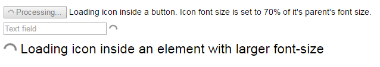

# loading-circle
Animated loading circle icon


It requires CSS3 Animations to work.

Simply add a `span` element with the `loading-circle` class.

```HTML
<span class="loading-circle"></span>
```

The icon is an inline-element, and it's size depends on the font-size property, which can be set to the icon itself or will be inherited from a parent element.



##Icon color
The default colors are dark and light.

```HTML
<div class="panel light">
  <span class="loading-circle loading-circle-dark"></span>
  Dark loading icon in a light space
</div>
<div class="panel dark">
  <span class="loading-circle loading-circle-light"></span>
  Light loading icon in a dark space
</div>
```

You can easily add icons with different colors.

```CSS
  .loading-circle-green::after,
  .loading-circle-green::before {
    border-color: rgba(0, 180, 0, .5);
  }

  .loading-circle-yellow::after,
  .loading-circle-yellow::before {
    border-color: rgba(255, 255, 0, .5);
  }

  .loading-circle-red::after,
  .loading-circle-red::before {
    border-color: rgba(255, 0, 0, .5);
  }
  ```
  
  
